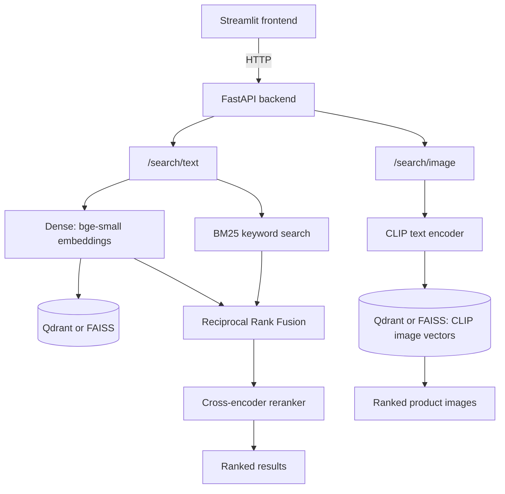

# E-Commerce Semantic Product Search

A semantic product search engine over a real e-commerce catalog: text and
image (multimodal/CLIP) search that goes beyond exact keyword matching,
targeting sub-200ms latency, fully containerized and runnable locally with
a single `docker compose up`.

## Table of Contents

- [Status](#status)
- [What this project does](#what-this-project-does)
- [Architecture](#architecture)
- [How this was built](#how-this-was-built)
- [Data](#data)
- [Stack](#stack)
- [Evaluation](#evaluation)
- [Latency](#latency)
- [Setup](#setup)
- [Running the App](#running-the-app)
- [Production hygiene](#production-hygiene)
- [Retrospective / lessons learned](#retrospective--lessons-learned)
- [Known limitations](#known-limitations)
- [License](#license)

## Status

All 8 phases complete — a working semantic search CLI (dense, BM25 keyword,
and hybrid+reranked modes) over the full catalog, plus a cross-modal
(text-to-image) search demo. Retrieval quality has been evaluated across
all 4 modes — see [Evaluation Results](docs/eval_results.md). Latency was
benchmarked in a warmed, cached process and optimized via request-level
caching and search parallelization; `dense` and `bm25` modes meet a
<200ms p95 target, `hybrid` improved substantially (229.6ms → 214.3ms)
but doesn't fully clear it due to a documented architectural constraint
in the keyword-search library — see
[Latency Results](docs/latency_results.md) for the full investigation.
A FastAPI backend and Streamlit frontend now serve both text and image
search over HTTP, either directly via `venv` or as a 3-container Docker
Compose stack (Qdrant + backend + frontend) — see
[Running the App](#running-the-app) below for both options.

- [x] Phase 1 — Text embedding baseline (FAISS + bge-small-en-v1.5)
- [x] Phase 2 — Multimodal (CLIP) module
- [x] Phase 3 — Hybrid retrieval + reranking
- [x] Phase 4 — Evaluation and latency engineering
- [x] Phase 5 — Serving layer (FastAPI + Streamlit)
- [x] Phase 6 — Deployment (local Docker Compose: Qdrant + FastAPI + Streamlit)
- [x] Phase 7 — Production hygiene (CI, logging, rate limiting)
- [x] Phase 8 — Documentation finalization

## What this project does

Most e-commerce site search only matches exact words. Search "cozy winter
coat" on a site that only has "warm jacket" in stock, and you get nothing
— even though a human would immediately see these mean almost the same
thing. This project fixes that by understanding the *meaning* of a query,
not just its keywords.

It does this in two ways over the same 55,516-product catalog:

- **Text search**: converts both the search query and every product's
  description into numerical vectors (embeddings) that capture meaning.
  Products whose vectors are close to the query's vector are semantically
  related, even if they don't share a single word. This is combined with
  traditional keyword search (which is still better at exact matches like
  brand names or model numbers) and a final re-ranking pass, so the system
  gets the best of both approaches.
- **Image search**: a separate demo lets you search a smaller product
  catalog *by image* using a text description — e.g. searching "something
  warm for rainy weather" returns matching product photos, without ever
  looking at a caption. This uses a different kind of embedding (CLIP)
  that understands both text and images in the same shared space.

Both are served over a real HTTP API with a web UI, run either directly on
your machine or as a small set of Docker containers, and are backed by
real, measured evaluation and latency numbers rather than just a demo that
"looks like it works."

## Architecture



The text path runs three retrieval modes behind one API: pure dense
(embedding similarity), pure BM25 (keyword), and `hybrid` (both run
concurrently, combined with Reciprocal Rank Fusion, then optionally
re-ranked by a cross-encoder for the final ordering — this is the default
mode). The vector index is FAISS locally or Qdrant when running via Docker
Compose, behind the same interface, so the rest of the pipeline doesn't
know or care which one is active. The image path is entirely separate: it
embeds a text query with CLIP into the same vector space as pre-computed
product image embeddings, so a text description can retrieve photos
directly.

## How this was built

This project was built in 8 phases, each adding a capability and
answering a specific question about the previous one's limitations.

**Phase 1 — Text embedding baseline.** Started with the simplest thing
that could demonstrate semantic search: embed the catalog once with
`BAAI/bge-small-en-v1.5` (a small, fast, CPU-friendly sentence-transformer)
and search it with a FAISS `IndexFlatIP` (exact cosine similarity search
over normalized vectors). This alone already beats keyword search on
paraphrased queries, and gave a working CLI end-to-end before adding any
complexity.

**Phase 2 — Multimodal (CLIP) module.** The main catalog has no product
images (the source retailer's Terms of Service prohibit image scraping),
so a cross-modal (text-to-image) search demo needed a separate, properly
licensed dataset — a public Kaggle fashion product dataset. This phase
embeds a ~5,000-item subset with CLIP, a model trained to place images and
text descriptions in the same vector space, so a plain-language query can
retrieve matching photos with no manual tagging involved.

**Phase 3 — Hybrid retrieval + reranking.** Dense embeddings alone are
weaker at exact-term matches — a specific brand name or model number is
often better served by traditional keyword search. This phase added BM25
keyword search alongside dense search, combined both ranked lists with
Reciprocal Rank Fusion, and added an optional cross-encoder reranking pass
over the fused candidates for a final quality boost on the top results.

**Phase 4 — Evaluation and latency engineering.** A search system's
quality claims are only as good as the measurements behind them. This
phase built a real evaluation harness (35 hand-labeled queries, pooled
relevance judgments across all 4 modes) and a latency benchmark (350 timed
calls per mode, in a warmed process) — see
[Evaluation Results](docs/eval_results.md) and
[Latency Results](docs/latency_results.md) for the actual numbers and the
engineering investigation behind them, including one optimization that was
tried, found to introduce a real correctness regression, and reverted
rather than shipped.

**Phase 5 — Serving layer.** A CLI is fine for development but doesn't
demonstrate a real product. This phase wrapped the same retrieval logic in
a FastAPI backend (serving all 4 text modes plus image search over HTTP)
and a Streamlit frontend, so the whole system could be used interactively
through a browser instead of a terminal.

**Phase 6 — Deployment.** This phase went through three real iterations.
The original plan was Qdrant Cloud plus Hugging Face Spaces (both free
tier) — but a real deploy attempt found HF now requires a paid PRO plan to
host Docker-based Spaces. The fallback was a hybrid split (backend on
Render, frontend on HF's native Streamlit SDK) — but Render's free and
cheap tiers don't have enough RAM for a backend loading three ML models
at once. The final, pragmatic choice: run the whole stack locally with
Docker Compose (Qdrant + backend + frontend), which is free, reproducible
on any machine, and still demonstrates real containerization and a real
vector database rather than just local files.

**Phase 7 — Production hygiene.** A demo-only app doesn't show
production-readiness thinking. This phase added CI (GitHub Actions running
lint and the full test suite on every push), structured JSON logging in
the backend, and per-IP rate limiting on the search endpoints — plus, once
real end-to-end CI verification was attempted, discovered and fixed a gap
where the search indexes (gitignored for size) were never actually being
built in the CI environment, so CI now builds and caches them.

**Phase 8 — Documentation finalization.** This README.

## Data

The catalog (`data/ecommerce_catalog_enriched.csv`, 55,516 rows) has been
sourced, genericized, and enriched already; see `data/DATA_DICTIONARY.md`
for the full schema. The source retailer's Terms of Service prohibit image
scraping, so this catalog has no product images.

The multimodal (CLIP) module (Phase 2) is demonstrated on a separate,
properly licensed public dataset:
[Mini Fashion Product Images and Text Dataset](https://www.kaggle.com/datasets/nirmalsankalana/mini-product-image-and-text-dataset)
by nirmalsankalana on Kaggle, MIT licensed, 44,441 fashion product
image/text pairs. Phase 2 embeds a ~5,000-item subset (stratified by
category) via CLIP for a cross-modal (text-to-image) search demo — this
is entirely separate from the main 55,516-row catalog used everywhere
else in this project.

## Stack

| Layer | Choice |
|---|---|
| Text embeddings | `BAAI/bge-small-en-v1.5` |
| Image embeddings | `openai/clip-vit-base-patch32` |
| Vector index (dev) | FAISS |
| Vector index (containerized) | Qdrant (self-hosted via Docker Compose) |
| Keyword search | `rank_bm25` |
| Reranker | `cross-encoder/ms-marco-MiniLM-L-6-v2` |
| Backend | FastAPI (`venv` or Docker Compose) |
| Frontend | Streamlit (`venv` or Docker Compose) |
| Deployment | Local Docker Compose (see [Running the App](#running-the-app)) |
| CI/CD | GitHub Actions (lint + full test suite on every push/PR) |

## Evaluation

Retrieval quality was measured across all 4 modes on 35 hand-labeled
queries (binary relevance, pooled candidates). Full methodology in
[docs/eval_results.md](docs/eval_results.md).

| Mode | Recall@10 | NDCG@10 | MRR |
|---|---|---|---|
| dense | 0.4441 | 0.9145 | 0.9486 |
| bm25 | 0.4120 | 0.8967 | 0.9429 |
| hybrid | 0.4437 | 0.9360 | 0.9857 |
| hybrid-rerank | 0.4285 | 0.9125 | 0.9357 |

## Latency

Latency was measured over 350 timed calls per mode in a warmed, cached
process, against a <200ms p95 target for `dense`/`bm25`/`hybrid`
(`hybrid-rerank` is not gated — the cross-encoder pass is inherently the
dominant cost there). `dense` and `bm25` pass with real margin; `hybrid`
improved from 229.6ms to 214.3ms via search parallelization but doesn't
fully clear the bar, due to `rank_bm25`'s brute-force full-corpus scoring
cost. Full methodology and investigation in
[docs/latency_results.md](docs/latency_results.md).

| Mode | p50 (ms) | p95 (ms) | p99 (ms) | Verdict |
|---|---|---|---|---|
| dense | 53.7 | 106.9 | 142.9 | PASS |
| bm25 | 83.9 | 146.3 | 150.4 | PASS |
| hybrid | 162.1 | 214.3 | 225.6 | FAIL |
| hybrid-rerank | 4735.2 | 6207.1 | 6662.9 | not gated |

## Setup

New to this project? Follow these steps in order — each one builds on the
last.

**1. Clone the repo and set up a Python virtual environment:**

```bash
git clone https://github.com/rohanagarwal96/EcommerceSemanticSearch.git
cd EcommerceSemanticSearch
python -m venv venv
source venv/Scripts/activate   # on Linux/Mac: source venv/bin/activate
```

**2. Install dependencies:**

```bash
pip install -r requirements.txt
pip install -e .
```

**3. Build the text search indexes** (one-time; the catalog CSV is
already included in this repo, so no download is needed for this step):

```bash
python scripts/build_index.py       # embeds all 55,516 products with bge-small-en-v1.5
python scripts/build_bm25_index.py  # builds the keyword (BM25) index
```

`build_index.py` embeds the full catalog and is the slow step — it took a
few hours on a low-power laptop CPU in development, but should be much
faster (likely under 30 minutes) on a typical desktop or server CPU.
`build_bm25_index.py` is fast (pure term-frequency counting, no neural
network, typically well under a minute).

**4. Run your first search** from the command line:

```bash
ecomsearch search "organic almond milk" --top-k 5 --mode hybrid-rerank
```

`--mode` accepts `dense` (pure embedding similarity), `bm25` (pure
keyword), `hybrid` (both combined), or `hybrid-rerank` (the default —
hybrid plus a final reranking pass) — useful for comparing retrieval
strategies against each other.

At this point you have a working text search CLI. To also try the
multimodal (CLIP) image search, or to run the full HTTP API + web UI, see
below.

### Multimodal (CLIP) demo

This is a separate, smaller demo on a different (properly licensed,
image-inclusive) dataset — see [Data](#data) for why. Requires a free
Kaggle account and API token saved at `~/.kaggle/kaggle.json`
([setup instructions](https://www.kaggle.com/docs/api)).

```bash
python scripts/download_multimodal_dataset.py  # downloads the ~5,000-item image dataset
python scripts/build_multimodal_index.py       # embeds it with CLIP
ecomsearch-images search "something warm for rainy weather" --top-k 5
```

Matched images are copied to `demo_results/<query-slug>/` for viewing.

## Running the App

A FastAPI backend serves all 4 text search modes plus multimodal image
search over HTTP; a Streamlit frontend consumes it. Both ways of running
the app below require the dense, BM25, and multimodal indexes built above.

This project intentionally runs locally rather than as a public cloud
deployment. During Phase 6 we evaluated free-tier cloud hosting options —
Hugging Face Spaces (Docker-SDK Spaces now require a paid PRO plan), Render
(its cheapest tiers with enough RAM for this backend's three-model
footprint start at $85/month), and Google Cloud Run (more setup overhead
than a portfolio demo justifies) — and concluded a small, reproducible
local stack was the better choice for demonstrating the system end-to-end
without ongoing cost.

### Option A: directly via `venv` (FAISS backend)

Start the backend (in one terminal):

```bash
uvicorn ecomsearch.api.app:app --reload
```

Serves the API at `http://localhost:8000` (interactive docs at
`/docs`). Startup pre-warms all search caches, so the first request is
fast — but this makes startup itself slow (real model loads).

Start the frontend (in a second terminal):

```bash
streamlit run src/ecomsearch/ui/streamlit_app.py
```

Serves the UI at `http://localhost:8501`, with tabs for text search and
image search. Set the `API_BASE_URL` environment variable (default
`http://localhost:8000`) to point the frontend at a different backend.

### Option B: Docker Compose (Qdrant + backend + frontend)

Runs the same app as three containers — a local Qdrant instance instead
of FAISS files, plus the backend and frontend. One-time setup to populate
Qdrant from your already-built local indexes:

```bash
docker compose up -d qdrant
python scripts/upload_index_to_qdrant.py
python scripts/upload_multimodal_index_to_qdrant.py
```

Then bring up the full stack:

```bash
docker compose up
```

Frontend at `http://localhost:8501`, backend at `http://localhost:8000`.
Qdrant's data persists in a named Docker volume, so the one-time setup
above only needs to run once per machine — future `docker compose up`
runs reuse the already-populated collections.

## Production hygiene

- **CI**: every push/PR runs Ruff (lint + format check) and the full
  pytest suite via GitHub Actions (`.github/workflows/ci.yml`). Since the
  FAISS/BM25/CLIP index files aren't committed to the repo (too large,
  gitignored), the test job builds them from scratch on a cache miss —
  requiring `KAGGLE_USERNAME`/`KAGGLE_KEY` repository secrets for the
  multimodal dataset — and caches the result keyed on the catalog and
  build-script contents, so only the first run (or a real data/script
  change) pays that cost.
- **Logging**: the FastAPI backend emits structured JSON logs to stdout
  (via `structlog`) for every request and every search, plus stack traces
  for unhandled exceptions — viewable with `docker compose logs backend`.
- **Rate limiting**: `/search/text` and `/search/image` are limited to 30
  requests/minute per client IP (via `slowapi`); exceeding it returns
  HTTP 429. `/health` and `/images/{item_id}` are unaffected.

## Retrospective / lessons learned

A few real engineering-judgment moments from building this, beyond what
the phase-by-phase summary above covers:

- **A "faster" algorithm change was reverted after it broke correctness.**
  While chasing `hybrid` mode's latency target (Phase 4), replacing
  BM25's full sort with a faster top-k selection algorithm looked like a
  clear win on paper. A targeted stress test caught it silently returning
  the wrong tied items in 86% of trials with tie-heavy score
  distributions — a real correctness regression that the initial
  (untested-on-ties) test suite had missed. It was reverted rather than
  shipped, even though the "faster" version would have looked fine in
  casual testing. See [Latency Results](docs/latency_results.md) for the
  full investigation.
- **Cloud deployment took three attempts to get right — or rather, to
  find out it wasn't worth getting "right" at all.** Each pivot in Phase
  6 was driven by a real constraint discovered only by actually trying to
  deploy, not by research alone: Hugging Face's Docker Spaces requiring a
  paid plan, then Render's free/cheap tiers not having enough RAM for a
  three-model backend. The eventual local-only Docker Compose choice
  wasn't a fallback out of laziness — it was the option that actually
  fit a zero-cost portfolio project's real constraints, once those
  constraints were fully understood.
- **CI passing locally doesn't mean CI passing for real.** Phase 7's
  GitHub Actions workflow looked complete and matched what ran locally —
  until the first real run on GitHub failed, because the FAISS/BM25/CLIP
  index files are gitignored (too large for git) and were never actually
  being built in that fresh environment. The fix (build them in CI, cache
  the result) only became obvious once the workflow was run for real
  instead of just reviewed.

## Known limitations

To be documented as they arise. Note in advance: the backend's startup
pre-warms three ML models (the bge-small embedder, the MiniLM
cross-encoder reranker, and CLIP) plus the BM25 index — the first
`docker compose up` after an image rebuild takes noticeably longer while
these load into memory before the backend reports healthy.

## License

MIT — see [LICENSE](LICENSE).
