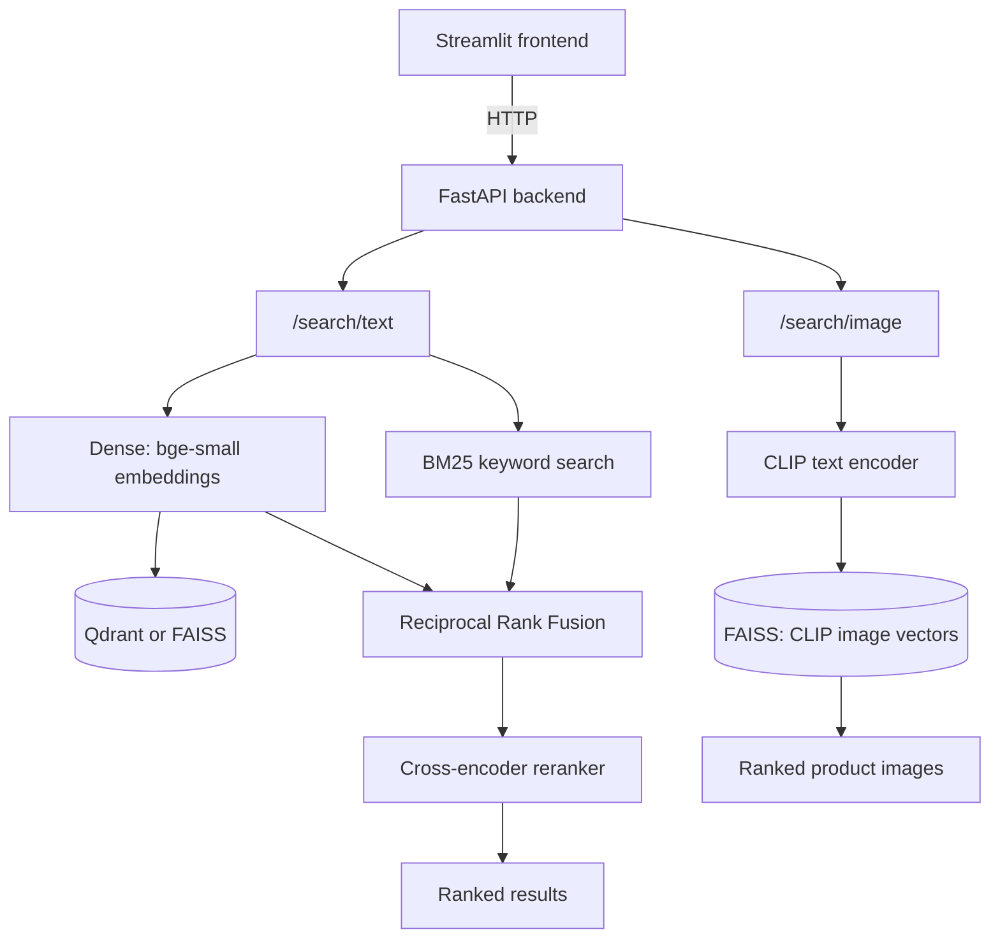

# Phase 8 Documentation Finalization Implementation Plan

> **For agentic workers:** REQUIRED SUB-SKILL: Use superpowers:subagent-driven-development (recommended) or superpowers:executing-plans to implement this plan task-by-task. Steps use checkbox (`- [ ]`) syntax for tracking.

**Goal:** Remove internal AI-development planning artifacts and rewrite the README into a beginner-friendly, portfolio-ready walkthrough of the whole project.

**Architecture:** Delete `docs/superpowers/` entirely, then expand `README.md` with a Table of Contents, a plain-language "What this project does" section, a Mermaid architecture diagram, a phase-by-phase "How this was built" narrative, a rewritten beginner-friendly Setup section, and a "Retrospective / lessons learned" section — while keeping every existing factual section (Data, Stack, Evaluation, Latency, Running the App, Production hygiene, Known limitations, License) substantively unchanged.

**Tech Stack:** Markdown, Mermaid (renders natively on GitHub, no new tooling).

---

### Task 1: Remove internal AI-development planning artifacts

**Files:**
- Delete: `docs/superpowers/` (entire directory, 20 files)

- [ ] **Step 1: Delete the directory**

```bash
git rm -r docs/superpowers
```

- [ ] **Step 2: Confirm nothing in tracked source references it**

Run: `grep -rln "docs/superpowers" src/ tests/ scripts/ README.md 2>/dev/null`
Expected: no output (these were always planning documentation, never imported or executed by any code).

- [ ] **Step 3: Run the full test suite**

Run: `venv/Scripts/python.exe -m pytest -v`
Expected: all tests pass (88 passed, 3 skipped) — this deletion touches no code path.

- [ ] **Step 4: Commit**

```bash
git commit -m "chore: remove internal AI-assisted-development planning docs"
git push origin main
```

---

### Task 2: Add Table of Contents, "What this project does", and Architecture sections

**Files:**
- Modify: `README.md`

- [ ] **Step 1: Insert a Table of Contents right after the title/pitch, before `## Status`**

Insert this block immediately after line 6 (the `a single \`docker compose up\`.` line) and before `## Status`:
```markdown
## Table of Contents

- [Status](#status)
- [What this project does](#what-this-project-does)
- [Architecture](#architecture)
- [How this was built](#how-this-was-built)
- [Data](#data)
- [Stack](#stack)
- [Evaluation](#evaluation)
- [Latency](#latency)
- [Setup](#setup)
- [Running the App](#running-the-app)
- [Production hygiene](#production-hygiene)
- [Retrospective / lessons learned](#retrospective--lessons-learned)
- [Known limitations](#known-limitations)
- [License](#license)
```

- [ ] **Step 2: Insert "What this project does" and "Architecture" sections right after `## Status`'s content, before `## Data`**

Insert this block immediately before the existing `## Data` heading (currently line 35):
```markdown
## What this project does

Most e-commerce site search only matches exact words. Search "cozy winter
coat" on a site that only has "warm jacket" in stock, and you get nothing
— even though a human would immediately see these mean almost the same
thing. This project fixes that by understanding the *meaning* of a query,
not just its keywords.

It does this in two ways over the same 55,516-product catalog:

- **Text search**: converts both the search query and every product's
  description into numerical vectors (embeddings) that capture meaning.
  Products whose vectors are close to the query's vector are semantically
  related, even if they don't share a single word. This is combined with
  traditional keyword search (which is still better at exact matches like
  brand names or model numbers) and a final re-ranking pass, so the system
  gets the best of both approaches.
- **Image search**: a separate demo lets you search a smaller product
  catalog *by image* using a text description — e.g. searching "something
  warm for rainy weather" returns matching product photos, without ever
  looking at a caption. This uses a different kind of embedding (CLIP)
  that understands both text and images in the same shared space.

Both are served over a real HTTP API with a web UI, run either directly on
your machine or as a small set of Docker containers, and are backed by
real, measured evaluation and latency numbers rather than just a demo that
"looks like it works."

## Architecture



The text path runs three retrieval modes behind one API: pure dense
(embedding similarity), pure BM25 (keyword), and `hybrid` (both run
concurrently, combined with Reciprocal Rank Fusion, then optionally
re-ranked by a cross-encoder for the final ordering — this is the default
mode). The vector index is FAISS locally or Qdrant when running via Docker
Compose, behind the same interface, so the rest of the pipeline doesn't
know or care which one is active. The image path is entirely separate: it
embeds a text query with CLIP into the same vector space as pre-computed
product image embeddings, so a text description can retrieve photos
directly.

```

- [ ] **Step 2: Verify the Mermaid diagram is syntactically valid**

There's no local Mermaid linter in this project's toolchain, so verify by inspection: every node is referenced consistently (same bracket style each time a node ID like `Dense` or `Fusion` appears), every arrow (`-->`) has a valid source and target, and the fenced code block is opened with ` ```mermaid ` and closed with ` ``` ` on its own line. GitHub renders Mermaid natively in README files — this is intentionally not converted to a static image so it stays easy to edit as plain text.

- [ ] **Step 3: Commit**

```bash
git add README.md
git commit -m "docs: add Table of Contents, project overview, and architecture diagram to README"
git push origin main
```

---

### Task 3: Add "How this was built" narrative section

**Files:**
- Modify: `README.md`

- [ ] **Step 1: Insert the section right after `## Architecture`'s content, before `## Data`**

Insert this block immediately before the `## Data` heading:
```markdown
## How this was built

This project was built in 8 phases, each adding a capability and
answering a specific question about the previous one's limitations.

**Phase 1 — Text embedding baseline.** Started with the simplest thing
that could demonstrate semantic search: embed the catalog once with
`BAAI/bge-small-en-v1.5` (a small, fast, CPU-friendly sentence-transformer)
and search it with a FAISS `IndexFlatIP` (exact cosine similarity search
over normalized vectors). This alone already beats keyword search on
paraphrased queries, and gave a working CLI end-to-end before adding any
complexity.

**Phase 2 — Multimodal (CLIP) module.** The main catalog has no product
images (the source retailer's Terms of Service prohibit image scraping),
so a cross-modal (text-to-image) search demo needed a separate, properly
licensed dataset — a public Kaggle fashion product dataset. This phase
embeds a ~5,000-item subset with CLIP, a model trained to place images and
text descriptions in the same vector space, so a plain-language query can
retrieve matching photos with no manual tagging involved.

**Phase 3 — Hybrid retrieval + reranking.** Dense embeddings alone are
weaker at exact-term matches — a specific brand name or model number is
often better served by traditional keyword search. This phase added BM25
keyword search alongside dense search, combined both ranked lists with
Reciprocal Rank Fusion, and added an optional cross-encoder reranking pass
over the fused candidates for a final quality boost on the top results.

**Phase 4 — Evaluation and latency engineering.** A search system's
quality claims are only as good as the measurements behind them. This
phase built a real evaluation harness (35 hand-labeled queries, pooled
relevance judgments across all 4 modes) and a latency benchmark (350 timed
calls per mode, in a warmed process) — see
[Evaluation Results](docs/eval_results.md) and
[Latency Results](docs/latency_results.md) for the actual numbers and the
engineering investigation behind them, including one optimization that was
tried, found to introduce a real correctness regression, and reverted
rather than shipped.

**Phase 5 — Serving layer.** A CLI is fine for development but doesn't
demonstrate a real product. This phase wrapped the same retrieval logic in
a FastAPI backend (serving all 4 text modes plus image search over HTTP)
and a Streamlit frontend, so the whole system could be used interactively
through a browser instead of a terminal.

**Phase 6 — Deployment.** This phase went through three real iterations.
The original plan was Qdrant Cloud plus Hugging Face Spaces (both free
tier) — but a real deploy attempt found HF now requires a paid PRO plan to
host Docker-based Spaces. The fallback was a hybrid split (backend on
Render, frontend on HF's native Streamlit SDK) — but Render's free and
cheap tiers don't have enough RAM for a backend loading three ML models
at once. The final, pragmatic choice: run the whole stack locally with
Docker Compose (Qdrant + backend + frontend), which is free, reproducible
on any machine, and still demonstrates real containerization and a real
vector database rather than just local files.

**Phase 7 — Production hygiene.** A demo-only app doesn't show
production-readiness thinking. This phase added CI (GitHub Actions running
lint and the full test suite on every push), structured JSON logging in
the backend, and per-IP rate limiting on the search endpoints — plus, once
real end-to-end CI verification was attempted, discovered and fixed a gap
where the search indexes (gitignored for size) were never actually being
built in the CI environment, so CI now builds and caches them.

**Phase 8 — Documentation finalization.** This README.

```

- [ ] **Step 2: Run the full test suite**

Run: `venv/Scripts/python.exe -m pytest -v`
Expected: all tests pass (88 passed, 3 skipped) — README-only change.

- [ ] **Step 3: Commit**

```bash
git add README.md
git commit -m "docs: add phase-by-phase How this was built narrative to README"
git push origin main
```

---

### Task 4: Rewrite Setup for a beginner-friendly walkthrough, remove demo placeholder

**Files:**
- Modify: `README.md`

- [ ] **Step 1: Replace the entire `## Setup` section (including its `### Multimodal (CLIP) demo` subsection) with this expanded version**

Replace everything from the `## Setup` heading through the `Matched images are copied to \`demo_results/<query-slug>/\` for viewing.` line with (find this block by its heading and content, not by line number — Tasks 2 and 3 will have shifted line numbers by inserting new sections earlier in the file):
```markdown
## Setup

New to this project? Follow these steps in order — each one builds on the
last.

**1. Clone the repo and set up a Python virtual environment:**

```bash
git clone https://github.com/rohanagarwal96/EcommerceSemanticSearch.git
cd EcommerceSemanticSearch
python -m venv venv
source venv/Scripts/activate   # on Linux/Mac: source venv/bin/activate
```

**2. Install dependencies:**

```bash
pip install -r requirements.txt
pip install -e .
```

**3. Build the text search indexes** (one-time; the catalog CSV is
already included in this repo, so no download is needed for this step):

```bash
python scripts/build_index.py       # embeds all 55,516 products with bge-small-en-v1.5
python scripts/build_bm25_index.py  # builds the keyword (BM25) index
```

`build_index.py` embeds the full catalog and is the slow step — it took a
few hours on a low-power laptop CPU in development, but should be much
faster (likely under 30 minutes) on a typical desktop or server CPU.
`build_bm25_index.py` is fast (pure term-frequency counting, no neural
network, typically well under a minute).

**4. Run your first search** from the command line:

```bash
ecomsearch search "organic almond milk" --top-k 5 --mode hybrid-rerank
```

`--mode` accepts `dense` (pure embedding similarity), `bm25` (pure
keyword), `hybrid` (both combined), or `hybrid-rerank` (the default —
hybrid plus a final reranking pass) — useful for comparing retrieval
strategies against each other.

At this point you have a working text search CLI. To also try the
multimodal (CLIP) image search, or to run the full HTTP API + web UI, see
below.

### Multimodal (CLIP) demo

This is a separate, smaller demo on a different (properly licensed,
image-inclusive) dataset — see [Data](#data) for why. Requires a free
Kaggle account and API token saved at `~/.kaggle/kaggle.json`
([setup instructions](https://www.kaggle.com/docs/api)).

```bash
python scripts/download_multimodal_dataset.py  # downloads the ~5,000-item image dataset
python scripts/build_multimodal_index.py       # embeds it with CLIP
ecomsearch-images search "something warm for rainy weather" --top-k 5
```

Matched images are copied to `demo_results/<query-slug>/` for viewing.
```

- [ ] **Step 2: Remove the demo GIF/video placeholder comment**

In the `## Running the App` section (now further down the file), delete this HTML comment entirely (it currently appears right before `## Production hygiene`):
```
<!-- Demo: a short GIF/video of a few example searches (with the latency
number visible) goes here once recorded. -->
```
Leave the blank line structure otherwise clean (one blank line between the preceding paragraph and `## Production hygiene`, not two).

- [ ] **Step 3: Run the full test suite**

Run: `venv/Scripts/python.exe -m pytest -v`
Expected: all tests pass (88 passed, 3 skipped) — README-only change.

- [ ] **Step 4: Commit**

```bash
git add README.md
git commit -m "docs: rewrite Setup as a beginner-friendly walkthrough, drop demo placeholder"
git push origin main
```

---

### Task 5: Add "Retrospective / lessons learned" section

**Files:**
- Modify: `README.md`

- [ ] **Step 1: Insert the section right after `## Production hygiene`'s content, before `## Known limitations`**

Insert this block immediately before the `## Known limitations` heading:
```markdown
## Retrospective / lessons learned

A few real engineering-judgment moments from building this, beyond what
the phase-by-phase summary above covers:

- **A "faster" algorithm change was reverted after it broke correctness.**
  While chasing `hybrid` mode's latency target (Phase 4), replacing
  BM25's full sort with a faster top-k selection algorithm looked like a
  clear win on paper. A targeted stress test caught it silently returning
  the wrong tied items in 86% of trials with tie-heavy score
  distributions — a real correctness regression that the initial
  (untested-on-ties) test suite had missed. It was reverted rather than
  shipped, even though the "faster" version would have looked fine in
  casual testing. See [Latency Results](docs/latency_results.md) for the
  full investigation.
- **Cloud deployment took three attempts to get right — or rather, to
  find out it wasn't worth getting "right" at all.** Each pivot in Phase
  6 was driven by a real constraint discovered only by actually trying to
  deploy, not by research alone: Hugging Face's Docker Spaces requiring a
  paid plan, then Render's free/cheap tiers not having enough RAM for a
  three-model backend. The eventual local-only Docker Compose choice
  wasn't a fallback out of laziness — it was the option that actually
  fit a zero-cost portfolio project's real constraints, once those
  constraints were fully understood.
- **CI passing locally doesn't mean CI passing for real.** Phase 7's
  GitHub Actions workflow looked complete and matched what ran locally —
  until the first real run on GitHub failed, because the FAISS/BM25/CLIP
  index files are gitignored (too large for git) and were never actually
  being built in that fresh environment. The fix (build them in CI, cache
  the result) only became obvious once the workflow was run for real
  instead of just reviewed.

```

- [ ] **Step 2: Run the full test suite**

Run: `venv/Scripts/python.exe -m pytest -v`
Expected: all tests pass (88 passed, 3 skipped) — README-only change.

- [ ] **Step 3: Commit**

```bash
git add README.md
git commit -m "docs: add Retrospective / lessons learned section to README"
git push origin main
```

---

### Task 6: Final read-through verification

**Files:** none (verification only)

- [ ] **Step 1: Read the entire finished README.md top to bottom**

Confirm: the Table of Contents links all resolve to real headings (GitHub auto-generates anchors as lowercase-with-hyphens, e.g. `## Retrospective / lessons learned` → `#retrospective--lessons-learned` — double-check this exact anchor since the `/` becomes nothing and the space becomes a double-hyphen); every command shown (`git clone`, `pip install`, `python scripts/*.py`, `ecomsearch search ...`, `docker compose ...`) matches an actual script/entry-point that exists in this repo; the architecture diagram's description matches `src/ecomsearch/search.py`'s actual `dense_search`/`bm25_search`/`hybrid_search` structure and `src/ecomsearch/multimodal/search.py`'s CLIP path.

- [ ] **Step 2: Run the full test suite one final time**

Run: `venv/Scripts/python.exe -m pytest -v`
Expected: 88 passed, 3 skipped.

- [ ] **Step 3: Confirm git state is clean**

Run: `git status` and `git log --oneline -8`
Expected: working tree clean, the 5 commits from Tasks 1-5 visible at the top of history, all pushed to `origin/main`.

- [ ] **Step 4: Report final status**

Summarize: `docs/superpowers/` removed, README restructured with ToC/overview/architecture/build-narrative/retrospective, Setup rewritten, demo placeholder dropped, all commits pushed, test suite green. No further commit needed for this task (verification only).
